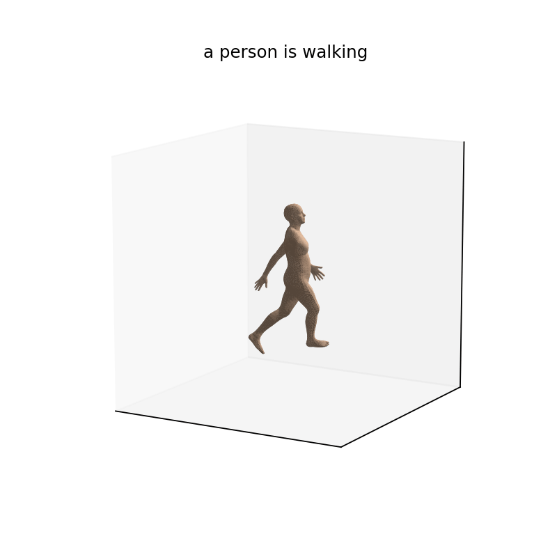
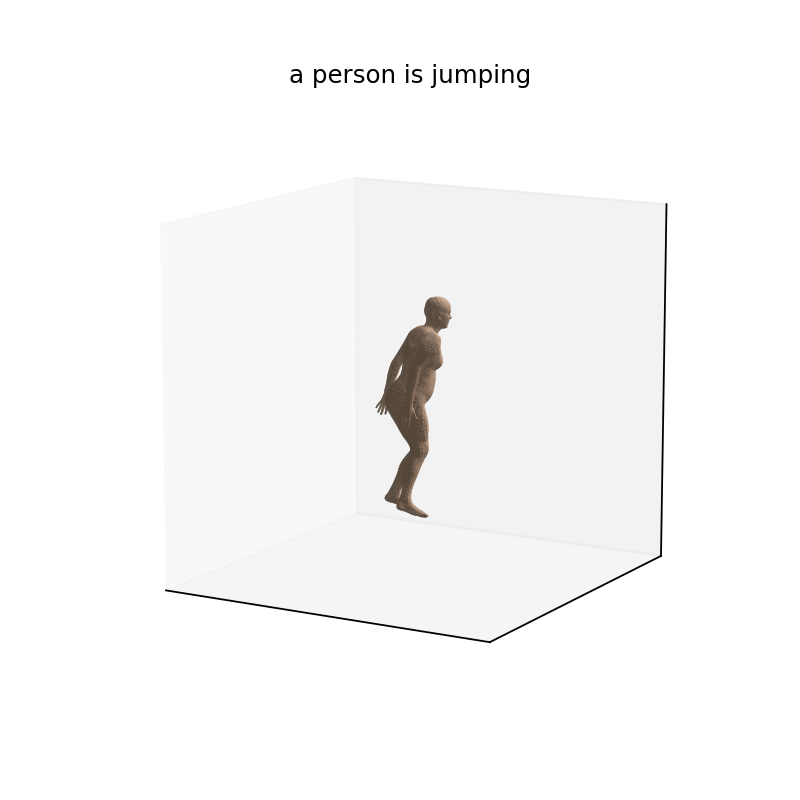
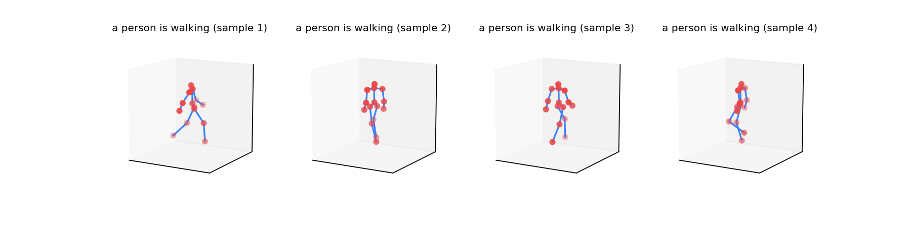
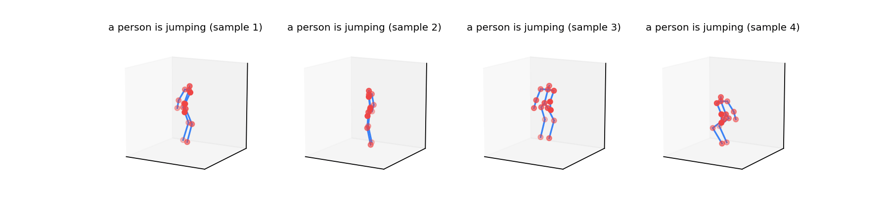
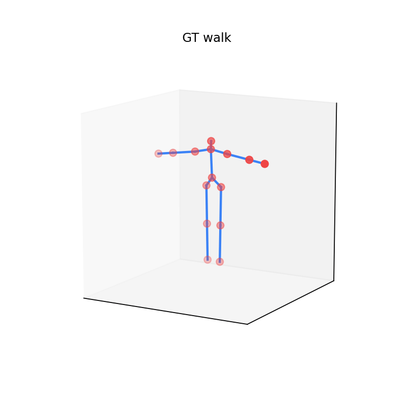
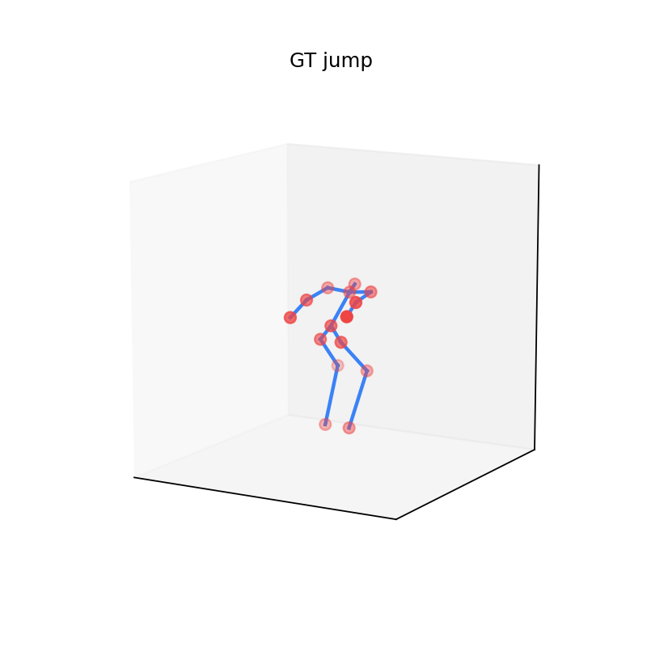

# Stickman Motion Diffusion

## 1. Cel

Wytrenować sieć dyfuzyjną, która z opisu tekstowego (`walk` / `jump`)
wygeneruje animację szkieletu 15-stawowego `[48, 15, 3]`. Wyjście ma być
różnorodne ale anatomicznie wiarygodne. Ewaluacja: FMD, MPJPE, Var
względem CMU mocap.

## 2. Rozwiązanie

Architektura w stylu MDM (Tevet et al. ICLR 2023): transformer encoder
jako denoiser DDPM, predykcja `x_0`, classifier-free guidance.

- Reprezentacja: 15 lokalnych rotacji w 6D ([Zhou 2019], Gram-Schmidt)
  + 3D translacja PELVIS, czyli `F = 93` na klatkę. Pozycje 3D z
  forward kinematics ze stałymi offsetami kości z BVH rest pose, więc
  długości kości z definicji zachowane.
- Tekst: frozen CLIP-ViT-B/32 + trenowalna projekcja liniowa do
  `d_model=256`.
- Denoiser: 6 warstw `TransformerEncoderLayer` (d=256, h=4, FFN=1024,
  GELU, pre-norm), token warunkujący `(t_emb + c_emb)` doklejony jako
  pierwszy w sekwencji. ~5.4M parametrów.
- Dyfuzja: cosine β-schedule, T=1000 (trening), DDIM (sampling).
- CFG: 10% dropout warunku w treningu, `x̂ = (1+w)·x_cond − w·x_uncond`.
- Strata: `MSE(x̂_0, x_0) + λ_pos·MSE_pos(FK) + λ_vel·MSE_vel + λ_bone·MSE_bone`
  z `λ_pos=1.0, λ_vel=0.5, λ_bone=0.1`. EMA decay 0.999.

## 3. Dane

CMU mocap (mirror `una-dinosauria/cmu-mocap`), kuratorska lista z
`cmu-mocap-index-text.txt`: 63 walks + 43 jumps. Pipeline:

1. `bvhio` ładuje BVH do pozycji świata 15 stawów (`Head`, `Neck1`, `Hips`,
   `{R,L}{Arm,ForeArm,Hand,UpLeg,Leg,Foot}`).
2. Kanonizacja: PELVIS na XZ=0, skala = `(head -> ankle)=1.0`, środek Y.
3. Resampling 120 do 24 FPS.
4. Inwersja `positions_to_rotations` (Procrustes na multi-child stawach,
   Rodrigues na pojedynczych) z rest-pose offsetami z BVH; FK round-trip
   MPJPE ~0.007.
5. Augmentacje online: mirror L<->R, yaw rotation.
6. Sliding window 48 klatek, ~850 wirtualnych próbek treningowych.

Prompts CLIP losowane z ~5 fraz/klasę (parafrazja).

## 4. Trening

- MPS, 300 epok, około 20 minut.
- `batch=32, lr=1e-4, AdamW, grad_clip=1.0, EMA=0.999`.
- Krzywa: `total` 0.26 do 0.014 (e1 do e300). Dominują `rec` (73%) + `pos` (25%).

## 5. Wyniki

Tabela metryk (300 epok, 24 próbek/klasa, CFG=1.0, 200 DDIM, savgol-9):

| Ruch |    FMD |  MPJPE |    Var |
| ---- | -----: | -----: | -----: |
| walk | 0.6868 | 0.0904 | 0.0079 |
| jump | 0.4482 | 0.1340 | 0.0123 |

Dla porównania po 60 epokach: `walk FMD=0.996, jump FMD=2.717`, Var
~3-5× mniejsza. Dłuższy trening wyciągnął model z mode collapse.

Search nad parametrami inferencji (default vs. najlepszy):

| Parametr              | Default | Best | Efekt                                                                                        |
| --------------------- | ------: | ---: | -------------------------------------------------------------------------------------------- |
| DDIM steps            |      50 |  200 | gładsza trajektoria w przestrzeni szumu                                                      |
| CFG scale             |     2.5 |  1.0 | mniej "wyostrzonych" artefaktów                                                              |
| Savitzky-Golay window |     off |    9 | filtr na rotacjach 6D przed FK (nie na pozycjach, bone-length zachowane przez Gram-Schmidt)  |

Retrening z `λ_vel=2.0, λ_accel=1.0` zbił accel w treningu, ale wizualnie
gorszy: kończyny "gumieją", ruch traci dynamikę. Lepiej post-processing.

### Wizualizacje




_Generacje na siatce SMPL (6890 wierzchołków). Pozy wyraźne i biomechanicznie wiarygodne._




_Cztery niezależne próbki per klasa (szkielet); różny kierunek, faza cyklu, amplituda._

 

_Referencyjne klipy GT (najbardziej energetyczne 48-klatkowe okno)._

## 6. Dyskusja metryk

| Metryka       | Mierzy                                             | Słabość                                            |
| ------------- | -------------------------------------------------- | -------------------------------------------------- |
| FMD           | Globalna zgodność rozkładów cech kinematycznych    | Czuła na wybór cech, niska przy mode collapse      |
| MPJPE-to-real | Lokalna odległość do najbliższego GT               | Penalizuje twórcze ale poprawne generacje          |
| Var           | Różnorodność między próbkami z tego samego promptu | Wysoka też dla szumu, sensowna tylko z FMD/MPJPE   |

Trio jest niezbędne: FMD trzyma jakość, Var kreatywność, MPJPE
przynależność do klasy. Sama wysoka Var nie znaczy "kreatywność": jeśli
model dryfuje w szum, Var i FMD rosną jednocześnie, i właśnie ten skok
FMD jest sygnałem alarmowym.

## 7. Ograniczenia

- Mały korpus (~10³ próbek vs ~14k w HumanML3D); większy mode collapse,
  słabsza generalizacja opisów.
- Brak fizyki: foot skating, przebijanie podłogi. Można dodać `L_fc` z MDM.
- Skala animacji: per-clip normalizacja, model nie zna zmienności
  rozmiarów ciała.
- Tylko 2 klasy: CLIP zbędny technicznie (`nn.Embedding(2, d)` wystarczy),
  zostaje jako baza pod rozbudowę.

## 8. Reprodukcja

```bash
uv sync
uv run wisp download-data && uv run wisp prepare-data
uv run wisp train --epochs 300 --device mps   # lub --device cuda
uv run wisp report --ckpt outputs/checkpoints/ema.pt
```

Pojedyncza animacja (domyślnie SMPL + savgol-9 + 200 DDIM + CFG=1.0):

```bash
uv run wisp sample --prompt "a person is walking" --out walk.gif
```

SMPL setup (jednorazowo, opcjonalne):

```bash
# Po rejestracji na https://smpl.is.tue.mpg.de/ i pobraniu .zip:
unzip -j SMPL_python_v.1.1.0.zip 'SMPL_python_v.1.1.0/smpl/models/basicmodel_neutral_lbs_10_207_0_v1.1.0.pkl' -d resources/smpl/
mv resources/smpl/basicmodel_neutral_lbs_10_207_0_v1.1.0.pkl resources/smpl/SMPL_NEUTRAL.pkl
uv run python scripts/setup_smpl.py
```
